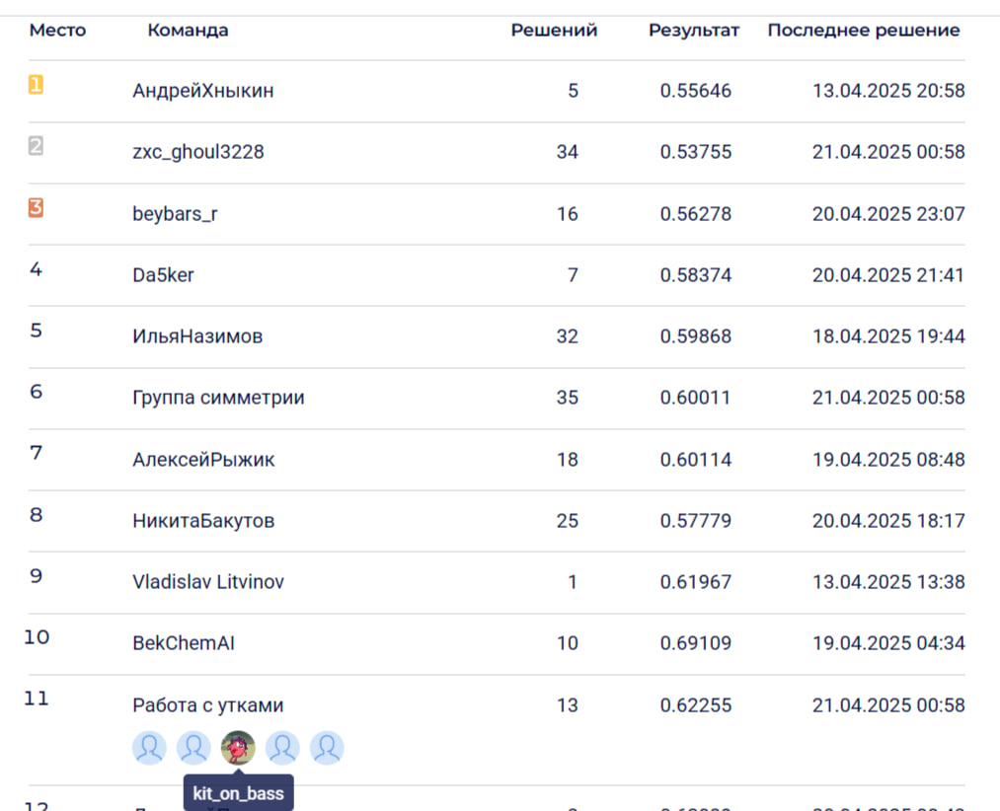

# Элемент-119 от Сибур
Хакатон по ИИ в химии от компании Сибур (11 место)

## Задача
Нужно было предсказать [липофильность (LogP)](https://ru.wikipedia.org/wiki/Липофильность) модекулы, заданной в виде SMILES.

$$
LogP = \frac{[концентрация]_{октанол}}{[концентрация]_{вода}}
$$

Оценка решения провоилась с помощью метрики [RMSE](https://en.wikipedia.org/wiki/Root_mean_square_deviation):

$$
RMSE(y, \hat{y}) = \sqrt{\frac{1}{N}\sum_{i=1}^{N}(y_i - \hat{y}_i)^2}
$$

## Решение
Использовались библиотеки `Chemprop` и `rdkit` — для построения message-passing модели (графовой нейросети) и работы с молекулярными данными.

## Результат

📈 Публичный лидерборд: 0.622554 \
📊 Приватный лидерборд: 0.675274 \
🥉 Место в таблице: 11

